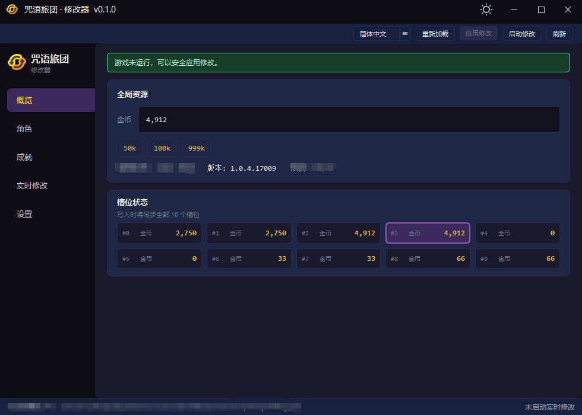
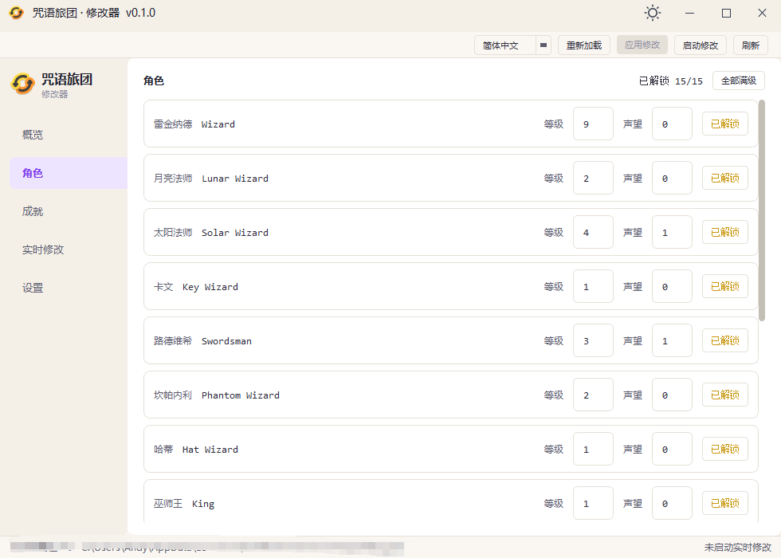
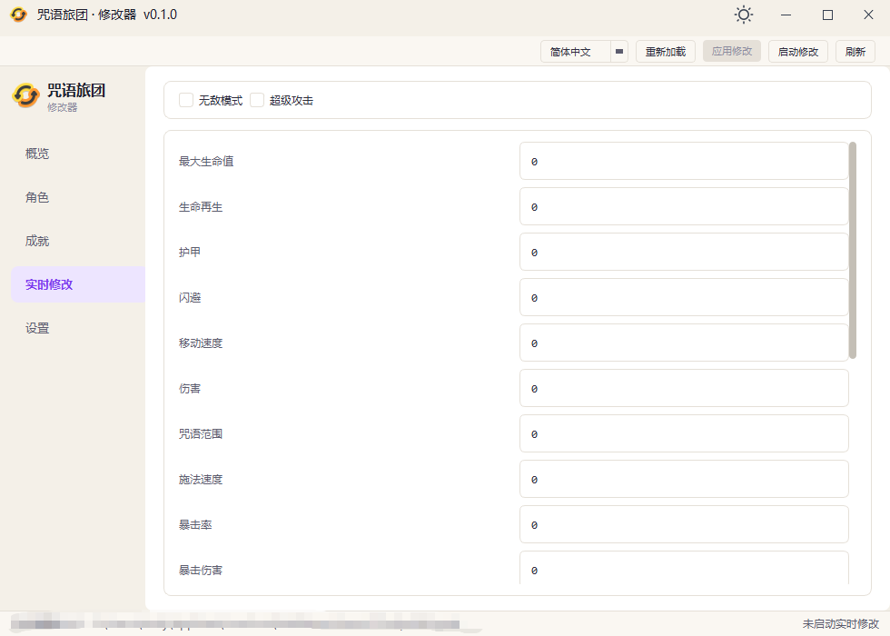

# 咒语旅团 `The Spell Brigade` 修改器 v0.2.0

[中文](README.md) · [English](docs/README.en.md)

---

《咒语旅团》桌面修改器，**仅支持 Windows**。在参考开源项目 [The Spell Brigade Save Editor](https://github.com/te-chan/the-spell-brigade-save-editor) 存档解析的基础上，提供完整存档编辑与对局内实时修改（Trainer）。

## 功能一览

| 页面       | 能力                                            |
| -------- | --------------------------------------------- |
| **概览**   | 修改金币（含快捷预设）、查看 10 个存档槽位状态                     |
| **角色**   | 解锁巫师、调整等级与声望、「全部满级」                           |
| **成就**   | 分类筛选、搜索、「全部解锁」                                |
| **实时修改** | 无敌模式、超级攻击、多项属性（改数值后按 **Enter** 生效，**Esc** 取消） |
| **设置**   | 自定义存档目录；顶栏可切换 **中/英** 与 **浅/深色** 主题           |

## 截图







## 使用前注意

- **存档修改**：建议 **先关闭游戏** 再点顶栏「应用修改」，避免存档被游戏覆盖。
- **写入范围**：应用修改时会 **同步写入全部 10 个槽位**（`save_slot_0` … `save_slot_9`）。
- **自动备份**：应用前会在存档目录下 `backups/` 创建时间戳备份，便于回滚。
- **实时修改**：需 **先启动游戏**，再点顶栏「启动修改」；仅在与下方「兼容性」匹配的游戏版本上可用。

## 使用方法

### 存档修改

1. 启动修改器，默认读取 Steam 版存档目录（见下方「兼容性」）。
2. 在侧边栏进入 **概览 / 角色 / 成就** 按需修改。
3. 确认顶栏提示「游戏未运行」后，点击 **应用修改**。

非默认安装路径可在 **设置** 中指定存档目录并「保存并重新加载」。

### 实时修改

1. 启动《咒语旅团》并进入对局。
2. 在修改器中打开 **实时修改** 页，点击顶栏 **启动修改**。
3. 勾选无敌 / 超级攻击，或在属性框输入数值后按 **Enter** 提交（**Esc** 放弃本次输入）。

## 兼容性与限制

| 项目             | 说明                                                                |
| -------------- | ----------------------------------------------------------------- |
| **操作系统**       | Windows 10 及以上                                                    |
| **游戏版本（实时修改）** | `1.0.4.17009`；其他版本偏移可能失效，需等待配置更新                                  |
| **默认存档路径**     | `%USERPROFILE%\AppData\LocalLow\BoltBlasterGames\TheSpellBrigade` |

## 获取方法

### 1. 直接下载

在 [GitHub Releases](https://github.com/lz166454-droid/The-Spell-Brigade-Modifier/releases) 下载 **`SpellBrigadeModifier.exe`**（单文件版，首次启动可能稍慢）。

### 2. 源码运行

**Python 3.11**

```powershell
python -m venv .venv
.\.venv\Scripts\Activate.ps1
pip install -r requirements.txt
py main.py
```

### 3. 自行打包

需已安装 **Python 3.11** 与 Windows **MSVC** 工具链（供 Nuitka 编译）。

单文件 exe：

```powershell
pip install -r requirements.txt
py build.py
```

输出：`dist\SpellBrigadeModifier.exe`

多文件目录版（启动更快、体积分散）：

```powershell
py build.py --folder
```

## 免责声明

本工具仅供单机体验与学习交流。修改存档或内存可能违反游戏服务条款，联机或成就相关风险请自行承担。与 [The Spell Brigade Save Editor](https://github.com/te-chan/the-spell-brigade-save-editor) 为独立项目，存档格式解析思路参考上游，Trainer 为本项目自行实现。
