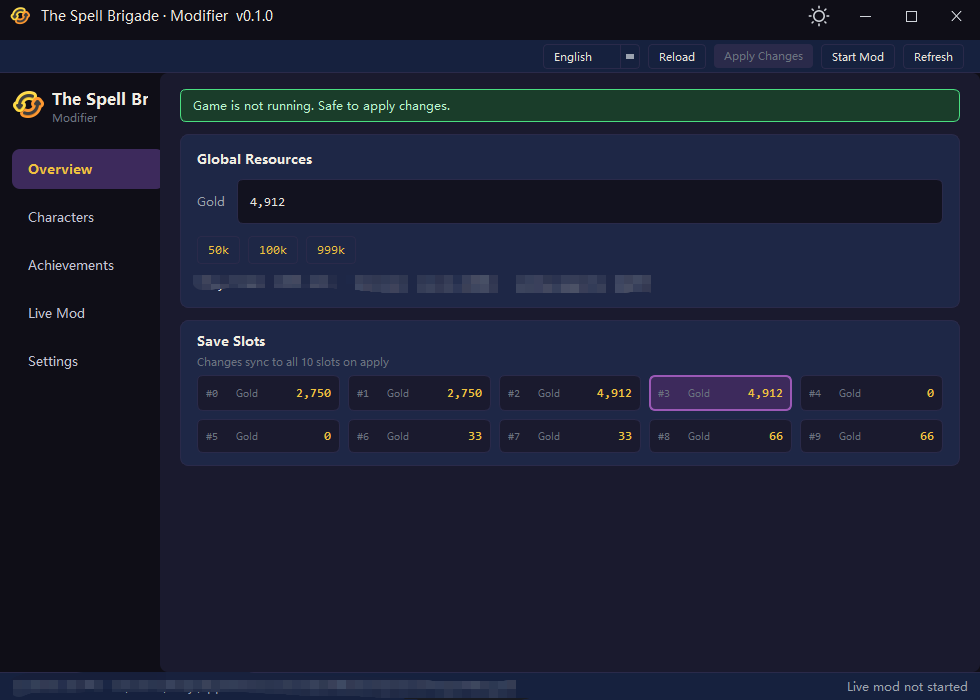
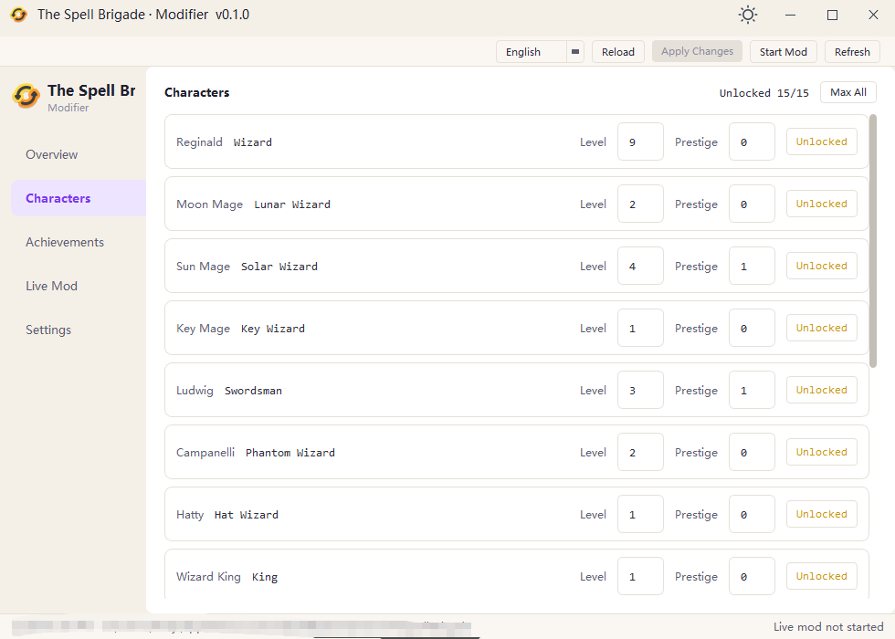
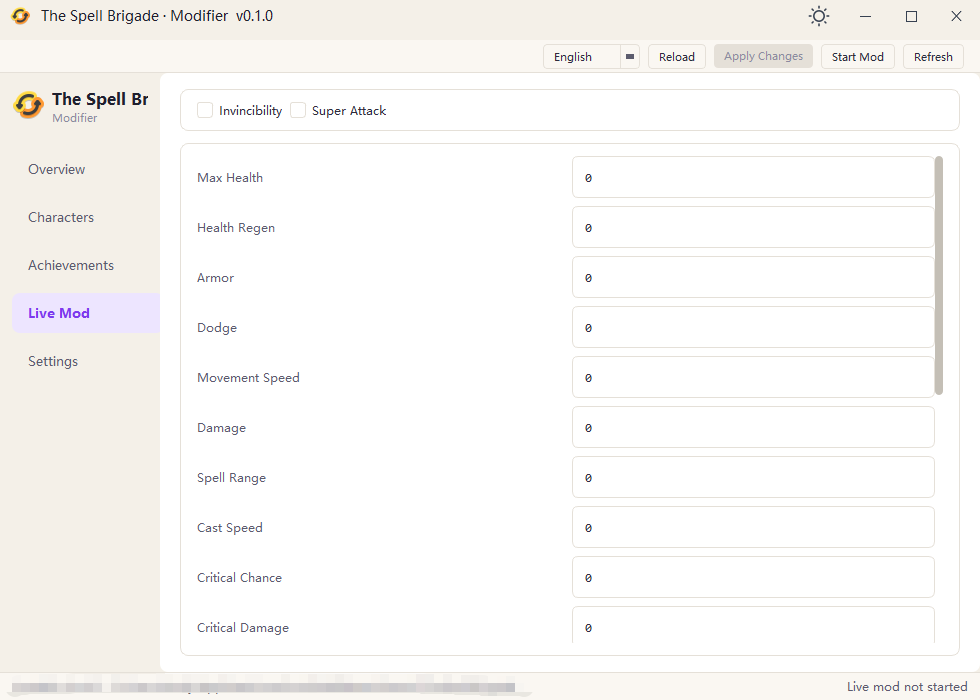

# Spell Brigade Modifier v0.2.1

[中文](../README.md) · [English](README.en.md)

---

A desktop modifier for **The Spell Brigade**, **Windows only**. Built on save parsing ideas from the open-source [The Spell Brigade Save Editor](https://github.com/te-chan/the-spell-brigade-save-editor), with full save editing plus in-game real-time modification (Trainer).

## Features

| Page            | What you can do                                                                  |
| --------------- | -------------------------------------------------------------------------------- |
| **Overview**    | Edit gold (with quick presets), view all 10 save slots                           |
| **Character**   | Unlock wizards, set level and prestige, **Max All**                              |
| **Achievement** | Filter by category, search, **Unlock All**                                       |
| **Trainer**     | Invincibility, super attack, stat tweaks (**Enter** to apply, **Esc** to cancel) |
| **Settings**    | Custom save directory; toolbar switches **language** and **light/dark** theme    |

## Screenshots







## Before You Start

- **Save edits**: **Close the game** before clicking **Apply Changes** in the toolbar to avoid the game overwriting your saves.
- **Write scope**: Applying changes **updates all 10 slots** (`save_slot_0` … `save_slot_9`).
- **Auto backup**: A timestamped copy is saved under `backups/` in your save folder before writing.
- **Trainer**: **Launch the game first**, then click **Start Trainer** in the toolbar. Works only on the game version listed under **Compatibility** below.

## Usage

### Save editing

1. Launch the modifier. By default it loads the Steam save folder (see **Compatibility**).
2. Use **Overview / Character / Achievement** in the sidebar.
3. When the banner says the game is not running, click **Apply Changes**.

If your saves are elsewhere, set the path in **Settings** and click **Save & Reload**.

### Real-time trainer

1. Start *The Spell Brigade* and enter a run.
2. Open the **Trainer** page and click **Start Trainer** in the toolbar.
3. Toggle invincibility / super attack, or type a stat value and press **Enter** (**Esc** discards the edit).

## Compatibility

| Item                       | Details                                                           |
| -------------------------- | ----------------------------------------------------------------- |
| **OS**                     | Windows 10 or later                                               |
| **Game version (Trainer)** | `1.0.4.17009`; other builds may break until offsets are updated   |
| **Default save path**      | `%USERPROFILE%\AppData\LocalLow\BoltBlasterGames\TheSpellBrigade` |

## Get the App

### 1. Download

Download **`SpellBrigadeModifier.exe`** from [GitHub Releases](https://github.com/lz166454-droid/The-Spell-Brigade-Modifier/releases) (one-file build; first launch may be slower).

### 2. Run from source

**Python 3.11**

```powershell
python -m venv .venv
.\.venv\Scripts\Activate.ps1
pip install -r requirements.txt
py main.py
```

### 3. Build yourself

Requires **Python 3.11** and the Windows **MSVC** toolchain (for Nuitka).

Single-file exe:

```powershell
pip install -r requirements.txt
py build.py
```

Output: `dist\SpellBrigadeModifier.exe`

Folder distribution (faster startup):

```powershell
py build.py --folder
```

## Disclaimer

For single-player and educational use. Editing saves or memory may violate the game's terms of service; online play and achievements are at your own risk. This is an independent project from [The Spell Brigade Save Editor](https://github.com/te-chan/the-spell-brigade-save-editor); save format parsing follows upstream ideas, while the Trainer is implemented here.
